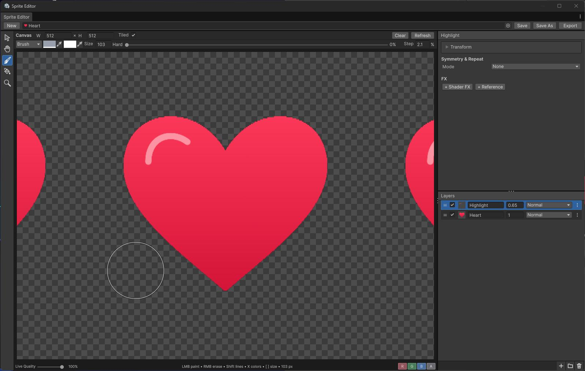

<h1 align="center">Unity Sprite Editor</h1>

<p align="center">
  Редактор многослойных спрайтов и текстур прямо внутри Unity.
</p>

<p align="center">
  <a href="package.json"></a>
  <a href="LICENSE.md"></a>
  <a href="#installation"></a>
  <a href="https://discord.gg/kqmJjExuCf"></a>
</p>

<p align="center">
  <a href="README.md">English</a> · <b>Русский</b>
</p>

<p align="center">
  <a href="#installation">Установка</a> ·
  <a href="#quick-start">Быстрый старт</a> ·
  <a href="#shortcuts">Горячие клавиши</a> ·
  <a href="CHANGELOG.md">История изменений</a> ·
  <a href="https://github.com/DCFApixels/Unity-SpriteEditor/issues">Сообщить об ошибке</a>
</p>

---

Создавай спрайты, иконки, паттерны и многослойные текстуры, не покидая Unity. Комбинируй исходные
изображения, рисуй на превью и добавляй процедурные эффекты. Редактируемая композиция и готовая
текстура сохраняются в одном ассете — отдельное изображение можно экспортировать при необходимости.

<p align="center">
  <a href="Documentation~/Images/sprite-editor-heart.jpg"></a>
</p>

> [!NOTE]
> Sprite Editor — инструмент **только для Unity Editor**, построенный на UI Toolkit.
> Сохранённые текстуры и спрайты можно использовать в игре без пересчёта слоёв.

## Возможности

| Направление | Главное |
| :--- | :--- |
| Слои | Изображения, рисование, заливки, градиенты, вложенные группы, мультивыделение и drag-and-drop. |
| Рисование | Кисть и ластик, прямые линии, заливка областей и маска RGBA-каналов. |
| Паттерны | Поворачиваемая зеркальная симметрия, ряды, сетки и повторение по кругу с обрезкой по границам. |
| Трансформ | Рамка на холсте, подвижный пивот с привязкой, пропорции источника, тайлинг и фильтрация. |
| Эффекты | Outline, SDF, режимы смешивания и встроенные Shader FX с редактируемым HLSL. |
| Результат | Документ с готовыми Texture2D/Sprite; экспорт в многослойный PSD, PNG, JPEG, TGA, EXR и Texture2D. |
| Автоматизация | C# и JSON API, опциональные CLI-команды и инструкция для агента. |

## Руководство

[Рабочее пространство](#workspace) · [Слои](#layers) · [Рисование и заливка](#painting) ·
[Симметрия](#symmetry) · [Трансформ](#transform) · [Эффекты](#effects) ·
[Сохранение и экспорт](#saving) · [Горячие клавиши](#shortcuts) · [API для агентов](#automation)

<a id="installation"></a>
## Установка

**Требуется Unity 6 (`6000.0`) или новее.** Burst, Collections и Newtonsoft Json указаны
в [зависимостях пакета](package.json).

В **Window → Package Management → Package Manager** выбери **Install package from git URL**:

```text
https://github.com/DCFApixels/Unity-SpriteEditor.git
```

<details>
<summary>Установка через manifest.json или фиксация версии</summary>

Добавь запись в объект `dependencies` файла `Packages/manifest.json`:

```json
"com.dcfa_pixels.sprite-editor": "https://github.com/DCFApixels/Unity-SpriteEditor.git"
```

Этот URL использует основную ветку. Для фиксации версии добавь `#<tag>` с существующим
[релизным тегом](https://github.com/DCFApixels/Unity-SpriteEditor/tags).
Плашка версии показывает [package.json](package.json), а не последний тег.

</details>

<a id="quick-start"></a>
## Быстрый старт

1. Открой **Window → Sprite Editor** и нажми **New**.
2. Задай размер холста полями **W** и **H** над превью.
3. Перетащи текстуру из Project на превью, чтобы добавить File-слой, или выбери
   **+ → Drawing Layer** в нижнем тулбаре Layers для рисования.
4. Выдели Drawing-слой, выбери **Brush** (`B`) и рисуй. Настройки появятся над превью.
5. Нажми `Ctrl+S`, чтобы сохранить документ и результат в полном разрешении.
6. Назначь сохранённый ассет в текстурное поле или раскрой его в Project и используй **Output Sprite**.

> [!TIP]
> Двойной клик по сохранённой текстуре, спрайту или вложенному документу со слоями открывает редактор.
> Также работают **Assets → Open in Sprite Editor** и кнопка в инспекторе документа.

<a id="workspace"></a>
## Рабочее пространство

**Превью находится слева**, **Layer Settings** и **Layers** — друг над другом справа.
Тяни разделители для изменения размеров сегментов; ширина правой панели сохраняется при ресайзе окна.
Layer Settings показывает настройки активного слоя; **Transform** по умолчанию свёрнут.
Следом расположен **Color & Blending**, тоже свёрнутый по умолчанию; состояние раскрытия сохраняется
при смене слоя в окне. Список **Standard / HDR** в заголовке меняет оба диапазона одним шагом Undo.
Пустое значение означает, что диапазоны различаются; раскройте блок, чтобы менять их независимо.

Инструмент выбирается на левой панели:

| Инструмент | Клавиша | Назначение |
| :--- | :---: | :--- |
| No Tool | `V` | Просмотр без маркеров редактирования и направляющих рисования. Используется, если нет сохранённого инструмента. |
| Transform | `T` | Перемещение, масштабирование и вращение слоя, кроме группы. |
| Brush | `B` | Рисование или стирание на Drawing-слое. |
| Pencil | `P` | Пиксельное рисование круглым, квадратным или ромбовым наконечником. |
| Fill | `G` | Заливка области или подходящих цветов на Drawing-слое. |
| Zoom | `Z` | Масштабирование кликом или выделением прямоугольной области. |

Настройки инструмента находятся над превью; при выборе No Tool строка остаётся на месте.
Удерживайте `Alt` (`Option` на macOS) с Brush, Pencil или Fill и кликните либо проведите
мышью, чтобы взять основной цвет из композиции всех слоёв. Пипетка использует полное
разрешение холста, работает в Tiled и сохраняет HDR и альфу, не учитывая экспозицию,
фильтрацию каналов, шахматку и Debug. Она не рисует, не добавляет шагов Undo и не меняет
выбранный инструмент. В режиме Standard взятый цвет по-прежнему отображается и рисуется без HDR-интенсивности.
Последний выбранный инструмент восстанавливается при повторном открытии окна и перезагрузке скриптов, даже если подходящий слой не выбран. Выход из Transform возвращает предыдущий инструмент.
Внизу превью всегда видны **Live Quality** слева и **RGBA-каналы** справа.

### Управление просмотром

С выбранной лупой клик приближает вдвое, `Alt`-клик отдаляет вдвое.
Потяни прямоугольник, чтобы вписать выбранную область в превью, включая пустое пространство вокруг изображения.
При любом инструменте перетаскивание с `СКМ` сдвигает вид, а колёсико меняет масштаб относительно курсора,
в том числе над пустой областью превью. `Escape` завершает навигацию или отменяет выделение области.
**Fit** показывает весь холст, **100%** — один пиксель изображения на одну единицу интерфейса.

Зум и перемещение меняют только вид и сохраняются при смене инструмента или слоя.
Открытие другого документа возвращает Fit.
**Live Quality** задаёт разрешение превью во время рисования: **12,5–100%**, по умолчанию **80%**.
Размер сохранённого холста и разрешение экспорта не меняются.

Включи **Tiled** рядом с размерами холста, чтобы заполнить всё превью повторениями композиции.
Рисовать можно на любой копии: отпечатки кисти и ластика переносятся через края и углы холста.
Масштаб, поворот и позиция слоя остаются редактируемыми — применять Transform не требуется.
Рисование по-прежнему меняет исходные пиксели Drawing-слоя, поэтому трансформированный слой принимает
мазки там, где его исходный прямоугольник покрывает холст. Размер документа и экспорта не меняется.

### Настройки инструментов и слоёв

Режим Brush/Eraser, цвета, размер, жёсткость, шаг кисти и параметры заливки — общие настройки
инструментов: они сохраняются при переключении слоёв и документов.
**Изменение настроек инструментов не добавляет шагов Undo.**
Симметрия, повторение и трансформ принадлежат отдельным слоям и остаются отменяемыми правками документа.

Кисть, карандаш и заливку можно выбирать и настраивать без Drawing-слоя; иконки приглушены, если действие недоступно.
Круг кисти остаётся видимым. Клик по нерисовальному слою предлагает конвертацию:
**Keep Transform**, **Apply Transform** или **Cancel**.
Этот клик не рисует и не заливает — после конвертации кликни снова.

<details>
<summary>Отдельные окна Properties и сброс рабочего пространства</summary>

Каждый вызов **⋮ → Properties** у слоя открывает отдельное окно. **FX** находится в том же меню строки.

**Меню ⋮ вкладки окна → Reset Sprite Editor Settings…** сбрасывает размеры панелей, прокрутку,
выделение, раскрытие разделов, инструменты превью, общие параметры рисования, каналы и Live Quality.
После подтверждения сброс действует на все открытые окна Sprite Editor и не имеет Undo.
Документы, несохранённая работа, настройки слоёв и ассеты не удаляются;
настройки Unity и расположение вкладок не меняются.

</details>

<a id="layers"></a>
## Слои и группы

**Типы слоёв:** File · Drawing · Color Fill · Gradient · Outline · SDF · Group.

Перетаскивай текстуры из Project в Layers, чтобы разместить их между строками или внутри группы.
Сброс на превью добавляет File-слои в начало корневого списка.
Первая текстура в пустом File-слое автоматически получает **Original Aspect**;
замена существующего источника сохраняет трансформ. Исходные ассеты не изменяются.

### Выделение и организация

Клик выбирает слой, `Ctrl`-клик переключает его выделение, `Shift`-клик выбирает диапазон видимых строк,
а `Ctrl+Shift`-клик добавляет диапазон. **Последний выбранный слой становится активным**:
он отмечен тонкой, чуть более яркой голубой обводкой.
Рисование, трансформ и Layer Settings работают с этим слоем.

В таблице выровнены колонки видимости, Name, прозрачности и Blend. Глаз в заголовке включает
видимость всех слоёв и групп. Клик по стрелке раскрывает/сворачивает группу, перетаскивание — перемещает её.

Тяни за фон или миниатюру выбранной строки, чтобы переместить всё выделение. Сбрасывай внутрь группы
для вложения или используй нижний тулбар:

| Иконка | Клик | Сброс выделенных слоёв |
| :--- | :--- | :--- |
| **+** | Добавить слой. | Дублировать выделение. |
| **Папка** | Сгруппировать выбранные слои. | Сгруппировать перетаскиваемое выделение. |
| **Корзина** | Удалить выбранные слои. | Удалить перетаскиваемое выделение. |

**⋮ → Duplicate** копирует отдельный слой или группу целиком. Копии появляются над оригиналами.
Пиксели Drawing и встроенные Shader FX независимы; внешние ассеты остаются ссылками.
Цели внутри копируемого набора перенаправляются на копии.
Перемещение, группировка, удаление и дублирование выделения поддерживают Undo/Redo.

**Слияние выделения:** `Ctrl+E` заменяет выбранные слои одним Drawing-слоем; `Ctrl+Alt+E` создаёт
объединённую копию, оставляя оригиналы включёнными. Обе команды также доступны через **⋮** или правый клик
по строке слоя. RMB по выделенной строке сохраняет выделение; невыделенная строка становится выбранной.
Группа включает всех потомков один раз. Видимое содержимое, трансформы, прозрачность и FX запекаются
в half-float пиксели полного разрешения холста; трансформ результата сбрасывается. Результат появляется
над верхней выбранной веткой в ближайшей общей группе. Слияние выполняется без подтверждения и отменяется одним Undo.
Смешивание с невыделенными слоями может измениться. Эффекты, нацеленные на удалённые слои, переключаются
на объединённый результат; Previous сохраняет прежний источник, если тот остаётся в документе.

По умолчанию группы работают в режиме **Pass Through**: дочерние слои смешиваются с общей композицией.
Другой режим смешивания изолирует группу. Прозрачность применяется к результату всей группы, включая вложенные.
Outline/SDF могут использовать собственное содержимое группы как источник. Групповые трансформы и FX пока не поддерживаются.

<details>
<summary>Имена слоёв, прозрачность и подробности дублирования</summary>

У каждого типа независимый счётчик внутри документа: `Layer n` для Drawing, `File n`,
`Color Fill n`, `Gradient n`, `Outline n`, `SDF n` и `Group n`.
Дубликаты сохраняют полное имя и получают суффикс ` Copy n` с отдельным общим счётчиком копий.
Номера удалённых слоёв не переиспользуются.

Цифры задают прозрачность выделенных слоёв и групп: `5` → 50%, затем `7` в пределах 0,6 секунды → 57%.
После паузы `7` → 70%. `0` означает 100%, быстрое `00` — 0%, а `05` — 5%.
Быстрая пара отменяется одним Undo. Меняется прозрачность слоя, а не кисти.

Выделенная группа переносит потомков только один раз. Дублируемые эффекты сохраняют источники:
если Previous больше не находится рядом, копия переключается на явную цель.
Клик по полям прозрачности и наложения в выделенных строках сохраняет выделение; изменение
назначает одинаковое значение всем выделенным строкам одним шагом Undo. Невыделенные потомки
выделенных групп не меняются. **Pass Through** применяется только к выделенным группам.
Остальные встроенные поля и меню строки действуют на эту строку; исключение — **Merge Selected**, использующий выделение.

</details>

<details>
<summary>Конвертация в Drawing и применение трансформа</summary>

**⋮ → Convert to Drawing** работает с любым слоем, включая уже рисовальный:

| Режим | Результат |
| :--- | :--- |
| **Keep Transform** | Растеризовать источник, оставив трансформ редактируемым. |
| **Apply Transform** | Запечь трансформ и тайлинг в пиксели полного разрешения; сбросить трансформ и установить Clip. |

Сохраняются ID, имя, позиция в списке, видимость, прозрачность, смешивание и живые FX.
Drawing-слои также сохраняют настройки повторения. Outline/SDF превращаются в статические пиксели.
Применение трансформа обрезает пиксели за пределами холста. Конвертация поддерживает Undo/Redo.

Группа объединяет видимых потомков с их трансформами и FX на прозрачном фоне.
Оба режима дают Drawing-слой с Normal, прозрачностью 1 и сброшенным трансформом.
Нужно подтверждение: взаимодействие с внешними слоями может измениться, а эффекты, направленные
на удалённых потомков, потеряют цели. Ссылки на саму конвертируемую группу сохраняются.

</details>

<a id="painting"></a>
## Рисование и заливка

### Кисть и карандаш

**Карандаш Pencil (`P`)** использует общие с кистью цвета и режим рисования/ластика, стирание на
`ПКМ`, смену цветов на `X`, прямые линии через Shift, маску каналов и симметрию слоя.
Край всегда чёткий: формы **Circle** (круг, по умолчанию), **Square** (квадрат) и **Diamond** (ромб).
Размер независим от кисти, по умолчанию **1 px**. Для обоих инструментов шаг `[` / `]` равен
1 px при размере меньше 20 px, затем — примерно 10% размера с округлением вниз.
Жёсткости и шага нет: линия идёт непрерывно по пиксельной сетке. Настройки карандаша общие для
слоёв, сохраняются в настройках инструментов и не попадают в Undo.
При увеличении контуры Circle и Diamond следуют границам пикселей. Если пиксели слишком мелкие
на экране или контур превышает 512 отрезков, включается упрощённый LOD. При движении курсора
его геометрия используется повторно, без перестроения.
При выбранном карандаше превью использует Point-фильтрацию и полное разрешение холста.
Live Quality временно фиксируется на 100%; при смене инструмента возвращаются сохранённое
качество и обычная фильтрация.

Выдели Drawing-слой и выбери Brush (`B`). Рисуй на превью, видя всю композицию
с учётом смешивания и эффектов.

- **Size**, **Hard** и **Step** задают диаметр, жёсткость и расстояние между отпечатками кисти.
  Step измеряется в процентах от диаметра. Значения **Size** и **Step** можно менять, потянув за лейбел.
- Два цветовых поля хранят основной и дополнительный цвет; `X` меняет их местами.
- `ЛКМ` использует выбранный режим Brush/Eraser; `ПКМ` временно включает ластик.
- `Shift` при перетаскивании фиксирует горизонтальную или вертикальную линию;
  `Shift`-клик соединяет предыдущую нарисованную точку с новой.

<details>
<summary>Поведение прямых линий</summary>

Чтобы начать отдельную линию вдоль оси, кликни без `Shift`, затем зажми `Shift` при перетаскивании.
Первое движение определяет ось в пространстве холста. Последовательные `Shift`-клики образуют
соединённые отрезки; ластик, шаг, симметрия и повторение применяются к ним тоже.

Clip ограничивает соединение начальной областью. Undo/Redo, очистка слоя и смена документа сбрасывают
точку соединения. Линии не продолжаются между разными Drawing-слоями или размерами холста.

</details>

### Заливка

Выбери Fill (`G`) и кликни. Основной цвет записывается **только в активный Drawing-слой**,
даже при выборке по всей композиции. Одна заливка — один шаг Undo/Redo.

| Настройка | Поведение | По умолчанию |
| :--- | :--- | :--- |
| **All Layers** | Выключен: выборка по исходным пикселям слоя до трансформа, прозрачности и FX. Включён: по видимой композиции в полном разрешении. | Выключен |
| **Contiguous** | Включён: связанная область под кликом. Выключен: все подходящие пиксели, включая отдельные области. | Включён |
| **Tolerance** | Порог сходства цвета и альфы, `0–255`. | `32` |
| **Antialias** | Смягчение внешнего края частичным покрытием. | Включён |
| **Expand (px)** | Расширение области под контур, `0–32` пикселя источника. Не зависит от Tolerance. | `0` |

<details>
<summary>Границы заливки и трансформированные слои</summary>

Contiguous учитывает соседей по четырём сторонам. При сравнении полностью прозрачных пикселей
скрытый RGB игнорируется. Tolerance, Antialias и Expand работают с обоими источниками выборки
и при любом состоянии Contiguous.

Заливка редактирует основную область источника и не повторяется через симметрию кисти.
Для тайловых копий за этой областью сначала используй **Convert to Drawing → Apply Transform**.
В All Layers композиция проецируется в сетку исходных пикселей. Для точных границ в пикселях
холста используй Drawing-слой размером с холст, без трансформа.

Live Quality не уменьшает разрешение выборки All Layers.
Защитный лимит памяти — 16 777 216 пикселей на исходное/опорное изображение.

</details>

### RGBA-каналы

Кнопки **R / G / B / A** внизу превью управляют отображением и маской цвета рисования.

- Отключённые RGB-каналы записываются как `0` в новых мазках и заливках.
- При выключенном A кисть и заливка не оставляют следа. Ластик игнорирует маску.
- Один выбранный R, G или B показывается в градациях серого, с прозрачностью при включённом A.
  Только A показывает непрозрачное изображение альфы в градациях серого. Два или три RGB-канала
  сохраняют свои цвета; выключенный A скрывает прозрачность. Все каналы выключены — чёрный экран.

Переключение каналов не меняет существующие пиксели, выбранные цвета и результат Save/Export.
Новые мазки и заливки с маской — настоящие изменения пикселей с Undo/Redo.

<a id="symmetry"></a>
## Симметрия и повторение

Открой **Symmetry & Repeat** в настройках Drawing-слоя. У каждого слоя своя конфигурация;
её изменение влияет на следующие мазки, а не на уже нарисованные пиксели.

| Режим | Настройки |
| :--- | :--- |
| **None** | Рисование без копий. |
| **Mirror** | Отражение по X и/или Y через **Center**. **Angle (°)** поворачивает обе оси, `0–360°`. |
| **Horizontal / Vertical** | Повторение в ряд или столбец с настраиваемым количеством копий. |
| **Grid** | Повторение с независимым количеством копий по X/Y. |
| **Radial** | Повторение вокруг **Center**, количество секторов и **Start Angle (°)**, `0–360°`. |

При 0° Mirror X отражает относительно вертикальной оси, Mirror Y — горизонтальной.
Угол Mirror поворачивает оси против часовой стрелки в пространстве пикселей источника.
Начальный угол Radial отсчитывается против часовой стрелки от направления влево;
он не зависит от угла Mirror.

**Elements → Copy / Alternate Mirror** задаёт обычные копии или отражение каждой второй копии
в Horizontal, Vertical, Grid и Radial. Mirror — отдельный режим, а не дополнительное отражение поверх них.

**Edges → Continue / Clip** работает в Mirror и всех режимах повторения.
Continue позволяет мазку пересекать границы областей. Clip останавливает его на границе начальной
области и обрезает отпечаток каждой копии по её собственной области. Активная копия остаётся под курсором.

<a id="transform"></a>
## Трансформ и пивот

Выдели слой, кроме группы, и выбери Transform (`T`).
Используй маркеры на превью или раскрой **Transform** в Layer Settings для числового ввода.

- Тяни внутри рамки для перемещения, за маркер стороны/угла для изменения размера,
  за круглый маркер для вращения.
- Перемещай **золотой крестик пивота**, не сдвигая изображение.
  Он притягивается к девяти точкам: углам, серединам сторон и центру. `Ctrl` отключает привязку.
- `Shift` ограничивает перемещение осью, сохраняет пропорции при масштабировании
  или задаёт шаг вращения 15°.
- `Escape` отменяет перетаскивание; `T` / `Enter` выходит из Transform.

**Reset** сбрасывает трансформ. **Original Aspect** вписывает пропорции источника в текущую рамку,
уменьшая одну ось и сохраняя центр изображения, пивот, вращение, отражение и тайлинг.
Filter независим от трансформа и сохраняется при Reset.

<details>
<summary>Тайлинг, фильтрация и координаты</summary>

| Tiling | Результат |
| :--- | :--- |
| **Clip** — по умолчанию | Пиксели за рамкой прозрачны. |
| **Repeat** | Повторение исходной текстуры. |
| **Mirror** | Чередование отражённых тайлов. |
| **Source** | Режимы источника, включая отдельные U/V. Clamp растягивает крайние пиксели вместо прозрачности. |

**Filter:** Source (по умолчанию) наследует Filter Mode текстуры; Point сохраняет чёткие границы
пикселей; Bilinear сглаживает выборку; Trilinear смешивает существующие mip-уровни.
Без mip-карт Trilinear работает как Bilinear. Для процедурных слоёв Source использует Bilinear.
Настройки импорта не меняются.

Рамка включает прозрачные пиксели источника. Position измеряется в пикселях результата,
Pivot — в нормализованных координатах, Scale — множитель, Rotation — градусы.
Радиус привязки пивота — 10 UI-пикселей; сам пивот может быть за рамкой.
Одно перетаскивание — один шаг Undo.

Original Aspect использует размеры текстуры File, сохранённых пикселей Drawing или пропорции
холста для процедурных слоёв. Без источника File и при близком к нулю масштабе кнопка неактивна;
такой масштаб также отключает перемещение пивота.

В Drawing тайлинг трансформа создаёт отображаемые копии, а рисование меняет исходный тайл.
Повторение кисти — отдельная функция.

</details>

<a id="effects"></a>
## Эффекты

### Outline и SDF

Используй элемент непосредственно под эффектом в той же группе (**Previous**) или назначь
слой/группу явно (**Specific**). Перетащи слой на **Target**, чтобы назначить источник;
при перетаскивании выделения используется активный слой. Это работает и в отдельных окнах Properties.
Цели из другого документа, ссылки на себя и циклические зависимости отклоняются.

Для группы объединяется альфа видимых потомков без изолированного смешивания их цвета.
Доступны **точный Euclidean EDT**, приближённый Euclidean, Manhattan и Chebyshev.
Ширина, мягкость и максимальное расстояние измеряются в пикселях результата;
обработка использует Burst и Native Collections.

### Смешивание

RGB-функции смешивания действуют в пересечениях слоёв; вне пересечений сохраняются цвет и альфа
присутствующего слоя по правилу source-over. **Overwrite** вместо этого заменяет весь RGBA-пиксель,
а прозрачность слоя интерполирует между старым и новым значением.
**None** оставляет композицию без изменений.

<details>
<summary>Список режимов смешивания</summary>

Normal · Add · Subtract · Multiply · Divide · Screen · Overlay · Darken · Lighten ·
Color Dodge · Color Burn · Linear Dodge (Add) · Linear Burn · Linear Light ·
Linear Light Add/Sub · Vivid Light · Pin Light · Hard Mix · Hard Light · Soft Light ·
Difference · Exclusion · Negation · None · Overwrite.

</details>

### Shader FX

Пиши фрагментный эффект прямо в настройках слоя — отдельный файл шейдера или материала не нужен.

1. Нажми **+ Shader FX** в разделе **FX** слоя.
2. Напиши `ApplyFX`, добавь параметры и нажми **Apply**.
3. Меняй значения параметров и сразу смотри результат. Сохрани документ, чтобы записать встроенный
   эффект и обновить итоговую текстуру.

Например, добавь параметр **Float** с именем `_Amount`:

```hlsl
float4 ApplyFX(float2 uv, float4 color)
{
    return float4(lerp(color.rgb, 1.0 - color.rgb, saturate(_Amount)), color.a);
}
```

Доступны параметры **Float**, **Color**, **Vector** и **Texture2D**; их uniform-переменные генерируются.
Код и объявления параметров остаются черновиком до Apply. При ошибке компиляции продолжает работать
последний успешный вариант. Редактор кода поддерживает Undo/Redo с восстановлением курсора и выделения;
восстановленный код тоже нужно применить через Apply.

<details>
<summary>Библиотеки, входы шейдера и переиспользуемые эффекты</summary>

Используй стандартный `#include` с путями проекта, пакета или относительными путями:

```hlsl
#include "Assets/Shaders/MyLibrary.hlsl"
#include "Packages/com.example.library/Shaders/MyLibrary.hlsl"
#include "./MyLibrary.hlsl"
```

Это примеры путей, а не встроенные библиотеки. Относительный путь отсчитывается от папки документа/FX,
до первого сохранения — от **Assets**. Вложенные подключения, include guards и `#include_with_pragmas`
обрабатывает препроцессор Unity; `UnityCG.cginc` уже подключён. Библиотека должна подходить
для этого окружения фрагментного шейдера. После её изменения снова нажми Apply.
При сохранении в другую папку проверь относительные пути.

`SampleInput(uv)` читает слой после предыдущих модификаторов. Возвращай **straight RGBA**:
прозрачность и смешивание слоя применяются позже. Встроенные входы: `_MainTex`, `_MainTex_TexelSize`,
`_InputSize`, `_CanvasSize` (`ширина, высота, 1/ширина, 1/высота`) и `_PreviewScale`
(число пикселей результата на пиксель превью). Не объявляй сгенерированные uniform-переменные повторно.

FX идут по порядку после трансформа слоя; один Shader FX — один проход GPU без чтения пикселей на CPU.
Материалы тоже поддерживаются как модификаторы. Встроенные код, параметры и скомпилированные шейдеры
хранятся в документе; изменение значений параметров не генерирует шейдеры заново.

**+ Reference** подключает внешний переиспользуемый FX; его правки влияют на всех пользователей.
**Embed** создаёт независимую копию внутри документа, не меняя исходный ассет.
Save As и дублирование слоёв независимо копируют встроенные FX.

</details>

<a id="saving"></a>
## Сохранение и экспорт

В шапке документа находятся **New · поле документа · Save · Save As · Export**.

| Действие | Результат |
| :--- | :--- |
| **Save** | Обновить текущий документ и результат без диалога. До первого сохранения неактивен. |
| **Save As** | Создать независимый редактируемый документ и результаты. |
| `Ctrl+S` | Сохранить существующий документ или открыть Save As для нового. |
| **Export** | Записать отдельное изображение или многослойный PSD. |

### Использование сохранённого ассета

В `.asset` находятся документ со слоями, текстуры Drawing, встроенные FX,
полноразмерная **Texture2D** как главный объект и **Output Sprite**.
Внешние исходные изображения и подключённые FX остаются ссылками.
Миниатюра в Project использует сохранённые пиксели.

Назначай главную текстуру материалу, RawImage или полю Texture2D.
Раскрой ассет, чтобы назначить Output Sprite в SpriteRenderer или UI Image.
Повторное сохранение сохраняет ссылки на результат, в том числе после изменения размера холста.
У Output Sprite центральный пивот, прямоугольная геометрия и 100 PPU.

> [!IMPORTANT]
> Результат соответствует последнему явному сохранению через Sprite Editor.
> После Undo/Redo, изменения FX или внешних текстур сохрани документ снова,
> чтобы обновить текстуру, используемую в других местах Unity.

<a id="export"></a>
### Форматы экспорта

| Формат | Результат |
| :--- | :--- |
| **PNG / TGA** | Прозрачность сохраняется. |
| **JPEG** | Белый фон, качество 95. |
| **EXR** | Линейный RGB + альфа, half-float с ZIP-сжатием. |
| **PSD** | Вложенные группы, растровые слои, редактируемые заливки/градиенты и совместимые обводки Outline; включает сведённое изображение. |
| **Texture2D (.asset)** | Читаемая самостоятельная текстура Unity, отдельная от документа со слоями. |

PNG/JPEG/TGA при экспорте в `Assets` импортируются как одиночные Sprite, EXR — как линейная текстура.
Замена самостоятельного Texture2D требует подтверждения и сохраняет ссылки.
Другие типы ассетов и вложенные ассеты защищены от перезаписи.

Композиция рассчитывается в **линейном HDR**. **Color Range** и **Blend Range** независимо управляют
диапазоном слоя и смешивания. Drawing начинает с 8-битного хранения и повышает его до half-float для HDR;
возврат в Standard не уничтожает сохранённый HDR. Явная команда **Convert to 8-bit** поддерживает Undo.
EXR и Texture2D сохраняют HDR; PNG/JPEG/TGA/PSD ограничивают только экспортируемую копию.

Кнопка **HDR** рядом с **EV** в footer превью переключает все редакторы цвета и градиента, не меняя
сохранённые значения и диапазоны слоёв. В Standard цвет отображается и рисует без HDR-интенсивности;
возврат в HDR восстанавливает сохранённый цвет. Ручное редактирование заменяет цвет новым.
По умолчанию выключена. Общая настройка сохраняется между запусками и не попадает в Undo.
**EV** и кнопка-жучок меняют только экспозицию превью и отображение числовых ошибок.
Подробнее: [HDR, хранение и группы](Documentation~/HDR.md).

**Многослойный PSD** сохраняет структуру и редактируемость: имена, порядок, видимость,
прозрачность и поддерживаемые режимы смешивания. SDF, Shader FX и несовместимые процедурные
настройки растрируются; неподдерживаемое смешивание заменяется приближённым.
Outline может остаться эффектом обводки по снимку альфы своего источника.
После экспорта в Console выводятся пояснения по конкретным слоям.
Храните исходный документ: PSD не сохраняет живые связи эффектов с таргетами и код шейдеров.
Подробнее: [экспорт PSD и API](Documentation~/PsdExport.md).

<a id="shortcuts"></a>
## Горячие клавиши

Инструменты: `V` — No Tool · `T` — Transform · `B` — Brush · `P` — Pencil · `G` — Fill · `Z` — Zoom.

| Сочетание | Действие |
| :--- | :--- |
| `Ctrl+S` | Save / Save As. |
| `Ctrl+Z` | Отмена. |
| `Ctrl+E` / `Ctrl+Alt+E` | Слить выделенные слои / создать объединённую копию. |
| `Ctrl+Y` / `Ctrl+Shift+Z` | Повтор. |
| `[` / `]` | Уменьшить / увеличить кисть. |
| `X` | Поменять основной и дополнительный цвет. |
| `Alt`-клик / перетаскивание с Brush, Pencil или Fill | Временно взять основной цвет из композиции. |
| `ПКМ` | Временно стирать при выбранной кисти. |
| `Shift` при перетаскивании / `Shift`-клик с кистью | Линия вдоль оси / соединение с предыдущей точкой. |
| `0`–`9` или numpad | Прозрачность активного слоя; быстрая пара задаёт процент. |
| `Ctrl`-клик / `Shift`-клик по слоям | Переключить выделение слоя / выбрать диапазон. |
| `Ctrl` при перемещении пивота | Отключить привязку. |
| `Alt`-клик при выбранной лупе | Отдалить. |
| Перетаскивание с `СКМ` / колёсико при любом инструменте | Сдвинуть вид / изменить масштаб относительно курсора. |
| `Enter` в Transform | Выйти из инструмента. |
| `Escape` во время трансформа или выделения лупой | Отменить действие. |

На macOS для сохранения, выделения и Undo/Redo также работает `Cmd`.
Текстовые и числовые поля сохраняют обычный ввод. Команды Unity Shortcut Manager приостановлены
только пока Sprite Editor в фокусе; при потере фокуса или закрытии они восстанавливаются.

<a id="automation"></a>
## API для агентов и CLI

Создавай документы, импортируй изображения, организовывай группы, меняй трансформы,
назначай цели эффектов и рисуй мазками на Drawing-слое без управления окном.
Версионированный JSON API поддерживает пачки команд, dry-run, стабильные ID,
проверку ревизий, Undo и рендер превью.

Публичный C# API работает без Pipeline. При установленном Unity Pipeline опциональные
команды `sprite_editor_*` предоставляют к нему доступ через Unity CLI.

- [Инструкция агенту](AGENTS.md) — порядок работы и правила безопасности.
- [Справочник API](Documentation~/AgentAPI.md) — операции, координаты, ограничения и полные сценарии.
- [Примеры JSON](Documentation~/Examples) — стартовые запросы.

<a id="community"></a>
## Сообщество и лицензия

Есть вопрос или идея? Заходи в **[Discord · RU / EN](https://discord.gg/kqmJjExuCf)**.
Для ошибок создай [GitHub issue](https://github.com/DCFApixels/Unity-SpriteEditor/issues)
с версией Unity и шагами воспроизведения.

Распространяется под **[лицензией MIT](LICENSE.md)**.
